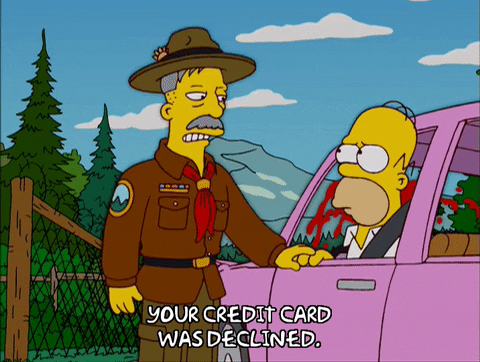

# Class Diagrams

**Please find class diagrams via the links below.  
(For best results, click these links inside Visual Studio to immediately view files in the correct format).**

## ~ ***Main Projects*** ~

### [*CrudOperations* ✨](CreditCardApplications/CardLib/CrudOperations.cd)

### [*DatabaseBackEnd* ✨](CreditCardApplications/DatabaseBackend/DatabaseBackEnd.cd)

### [*FrontEnd* ✨](CreditCardApplications/FrontEnd/FrontEnd.cd)

## ~ ***Data Projects*** ~

### [*Globals* 📚](CreditCardApplications/CreditCardApplicantData/Globals.cd)

## ~ ***Test Projects*** ~

### [*CrudOperationsTests* 🏆](CreditCardApplications/CrudManagerTests/CrudOperationTests.cd)

### [*DatabaseBackEndTests* 🏆](CreditCardApplications/DatabaseBackEndTests/DatabaseBackEndTests.cd)

### [*FrontEndTests* 🏆](CreditCardApplications/FrontEndTests/FrontEndTests.cd)

