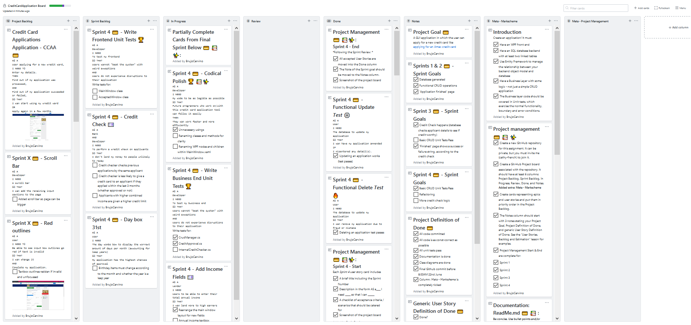

# Project 2 - CreditCardApplications

### An application which allows users to apply for a new credit card


<br/><br/>

## The Project

~ ***[Please refer to the Github Project board here](https://github.com/users/BrujoCervino/projects/1)*** ~
<br/>
**Timeframe**: Sat: Jun-13-2020 - Mon: Jun-22-2020
<br/><br/>

### 1 - Goals and Definition of Done<br/><br/>

💳 **[Project Goal](https://github.com/users/BrujoCervino/projects/1#card-40161516)**:
A GUI application in which the user can apply for a new credit card like [applying for an Amex credit card](https://www.americanexpress.com/en-gb/credit-cards/apply/personal/gold-credit?intlink=uk-amex-cardshop-details-apply-GoldCreditCard-top).


💳 [**Sprint 1 & 2 Goals**](https://github.com/users/BrujoCervino/projects/1#card-40190169)

💳 [**Sprint 3 Goals**](https://github.com/users/BrujoCervino/projects/1#card-40287094)

💳 [**Sprint 4 Goals**](https://github.com/users/BrujoCervino/projects/1#card-40438537)

💳 **[Project Definition of Done](https://github.com/users/BrujoCervino/projects/1#card-40161516)**:
<br/>(See link above)

💳 **[Generic User Story Definition of Done](https://github.com/users/BrujoCervino/projects/1#card-40170129)**
```
AS A 
User
I NEED TO
apply for a credit card
THEN
See whether my application suceeded 
AND 
Whether my input was valid
SO THAT
I can receive my credit card
```

<br/>

### 2 - Sprint Breakdown and Reviews<br/><br/>

💳 **[Sprint Breakdown](https://github.com/users/BrujoCervino/projects/1#card-40165324)**
<br/>
 ~ ***Click images below to see them in full size*** ~
<br/>

|Sprint|Timeframe|Done?|Screenshot Start [Files](https://github.com/BrujoCervino/CreditCardApplications/tree/master/SprintScreenshots)|Screenshot End [Files](https://github.com/BrujoCervino/CreditCardApplications/tree/master/SprintScreenshots)
|------|-----------------------------|---|--|--|
|0 (***Meta-sprint***)    |Weekend         |✅|[*Unnecessary*]|[](SprintScreenshots/Sprint0_Board.png)|
|1     |Monday - Early Tuesday       |✅|[](SprintScreenshots/Sprint1_Board_Start.png)|[](SprintScreenshots/Sprint1_Board_End.png)|
|2     |Late Tuesday - Early Thursday|✅|[](SprintScreenshots/Sprint2_Board_Start.png)|[](SprintScreenshots/Sprint2_Board_End.png)|
|3     |Late Thursday - Early Friday |✅|[](SprintScreenshots/Sprint3_Board_Start.png)|[](SprintScreenshots/Sprint3_Board_End.png)|
|4     |Late Friday - Late Saturday  |✅|[](SprintScreenshots/Sprint4_Board_Start.png)|[](SprintScreenshots/Sprint4_Board_End.png)|
|[***End***]|[***End***]|✅|[](SprintScreenshots/SprintFinal_Board_Start.png)|[*Unnecessary*]|

💳 **Sprint Reviews**

♦ **0: Mon, Jun-13**: Showed stakeholder my GUI.<br/>
♦ **1: Tue, Jun-14**: Showed stakeholder my project management ([ReadMe.md](https://github.com/BrujoCervino/CreditCardApplications/blob/master/README.md) and [Project Board](https://github.com/users/BrujoCervino/projects/1)). 
<br/>♣   Renamed [Sprint 1 💳 - Sprint Goals](https://github.com/users/BrujoCervino/projects/1#card-40190169) to *Sprint 2 💳 - Sprint Goals* <br/>

|Name|Moved From Column|Moved To Column|
|----|-----------------|---------------|
|[Sprint 0](https://github.com/users/BrujoCervino/projects/1#card-40162414)|[Review](https://github.com/users/BrujoCervino/projects/1#column-9611786)|[Done](https://github.com/users/BrujoCervino/projects/1#column-9611771)|
|[Project Management 💳 📚✨: Sprint 1 - End](https://github.com/users/BrujoCervino/projects/1#card-40171151)|[Review](https://github.com/users/BrujoCervino/projects/1#column-9611786)|[Done](https://github.com/users/BrujoCervino/projects/1#column-9611771)|
|[Project Management 💳 📚✨: Sprint 1 - Start](https://github.com/users/BrujoCervino/projects/1#card-40171151)|[Review](https://github.com/users/BrujoCervino/projects/1#column-9611786)|[Done](https://github.com/users/BrujoCervino/projects/1#column-9611771)|

♦ **2: Thu, Jun-18**: Showed **stakeholder group** the new 'Accepted' Window and my project management
<br/>

|Name|Moved From Column|Moved To Column|
|----|-----------------|---------------|
|[Project Management 💳 📚✨:Sprint 2 - Start](https://github.com/users/BrujoCervino/projects/1#card-40171942)|[Review](https://github.com/users/BrujoCervino/projects/1#column-9611786)|[Done](https://github.com/users/BrujoCervino/projects/1#column-9611771)|
|[Sprint 2 💳 - 'Application Finished' Page 📃](https://github.com/users/BrujoCervino/projects/1#card-40288826)|[Review](https://github.com/users/BrujoCervino/projects/1#column-9611786)|[Done](https://github.com/users/BrujoCervino/projects/1#column-9611771)|
|[Sprint 2 💳 - Generate Database](https://github.com/users/BrujoCervino/projects/1#card-40171523)|[Review](https://github.com/users/BrujoCervino/projects/1#column-9611786)|[Done](https://github.com/users/BrujoCervino/projects/1#column-9611771)|
|[Sprint 2 💳 - Functional Create ✨](https://github.com/users/BrujoCervino/projects/1#card-40204405)|[Review](https://github.com/users/BrujoCervino/projects/1#column-9611786)|[Done](https://github.com/users/BrujoCervino/projects/1#column-9611771)|
|[Sprint 2 💳 - Functional Read 📚](https://github.com/users/BrujoCervino/projects/1#card-40206819)|[Review](https://github.com/users/BrujoCervino/projects/1#column-9611786)|[Done](https://github.com/users/BrujoCervino/projects/1#column-9611771)|
|[Sprint 2 💳 - Functional Delete 🔥](https://github.com/users/BrujoCervino/projects/1#card-40207360)|[Review](https://github.com/users/BrujoCervino/projects/1#column-9611786)|[Done](https://github.com/users/BrujoCervino/projects/1#column-9611771)|
|[Sprint 2 💳 - Functional Update ⚙️](https://github.com/users/BrujoCervino/projects/1#card-40316123)|[Review](https://github.com/users/BrujoCervino/projects/1#column-9611786)|[Done](https://github.com/users/BrujoCervino/projects/1#column-9611771)|
|[Project Management 💳 📚✨: Sprint 2 - End](https://github.com/users/BrujoCervino/projects/1#card-40171967)|[Review](https://github.com/users/BrujoCervino/projects/1#column-9611786)|[Done](https://github.com/users/BrujoCervino/projects/1#column-9611771)|
|[Sprints 1 & 2 💳  - Sprint Goals](https://github.com/users/BrujoCervino/projects/1#card-40190169)|[Review](https://github.com/users/BrujoCervino/projects/1#column-9611786)|[Notes](https://github.com/users/BrujoCervino/projects/1#column-9611790)|

<br/>

♦ **3: Fri, Jun 19**: Showed stakeholder my GUI, project management and code
<br/>

|Name|Moved From Column|Moved To Column|
|----|-----------------|---------------|
|[Project Management 💳 📚✨: Sprint 3 - Start](https://github.com/users/BrujoCervino/projects/1#card-40172042)|[Review](https://github.com/users/BrujoCervino/projects/1#column-9611786)|[Done](https://github.com/users/BrujoCervino/projects/1#column-9611771)|
|[Sprint 3 💳 - User cannot submit until they have chosen the needed details 2 📅](https://github.com/users/BrujoCervino/projects/1#card-40356831)|[Review](https://github.com/users/BrujoCervino/projects/1#column-9611786)|[Done](https://github.com/users/BrujoCervino/projects/1#column-9611771)|
|[Sprint 3 💳 - User cannot submit until they have chosen the needed details 1 📅](https://github.com/users/BrujoCervino/projects/1#card-40346811)|[Review](https://github.com/users/BrujoCervino/projects/1#column-9611786)|[Done](https://github.com/users/BrujoCervino/projects/1#column-9611771)|
|[Sprint 3 💳 - Titles table Ⓜ️®️(💲)](https://github.com/users/BrujoCervino/projects/1#card-40316929)|[Review](https://github.com/users/BrujoCervino/projects/1#column-9611786)|[Done](https://github.com/users/BrujoCervino/projects/1#column-9611771)|
|[Sprint 3 💳 - Finished Page Shows Application Success ✔️/❌](https://github.com/users/BrujoCervino/projects/1#card-40167618)|[Review](https://github.com/users/BrujoCervino/projects/1#column-9611786)|[Done](https://github.com/users/BrujoCervino/projects/1#column-9611771)|
|[Sprint 3 💳 -  Applications table](https://github.com/users/BrujoCervino/projects/1#card-40316936)|[Review](https://github.com/users/BrujoCervino/projects/1#column-9611786)|[Done](https://github.com/users/BrujoCervino/projects/1#column-9611771)|
|[Sprint 3 💳 - Empty Credit Check 💷](https://github.com/users/BrujoCervino/projects/1#card-40361850)|[Review](https://github.com/users/BrujoCervino/projects/1#column-9611786)|[Done](https://github.com/users/BrujoCervino/projects/1#column-9611771)|
|[ Project Management 💳 📚✨: Sprint 3 - End](https://github.com/users/BrujoCervino/projects/1#card-40172015)|[Review](https://github.com/users/BrujoCervino/projects/1#column-9611786)|[Done](https://github.com/users/BrujoCervino/projects/1#column-9611771)|
|[Sprint 3 💳 - Sprint Goals](https://github.com/users/BrujoCervino/projects/1#card-40287094)|[Review](https://github.com/users/BrujoCervino/projects/1#column-9611786)|[Notes](https://github.com/users/BrujoCervino/projects/1#column-9611790)|

<br/>

♦ **4: Sat, Jun 20**: Acted as stakeholder: reviewed my own GUI, project management and code
<br/>

|Name|Moved From Column|Moved To Column|
|----|-----------------|---------------|
|[Project Management 💳 📚✨: Sprint 4 - Start](https://github.com/users/BrujoCervino/projects/1#card-40172049)|[Review](https://github.com/users/BrujoCervino/projects/1#column-9611786)|[Done](https://github.com/users/BrujoCervino/projects/1#column-9611771)|
|[Sprint 4 💳 - Functional Delete *Test* 🔥](https://github.com/users/BrujoCervino/projects/1#card-40316102)|[Review](https://github.com/users/BrujoCervino/projects/1#column-9611786)|[Done](https://github.com/users/BrujoCervino/projects/1#column-9611771)|
|[Sprint 4 💳 - Functional Update *Test* ⚙️](https://github.com/users/BrujoCervino/projects/1#card-40207202)|[Review](https://github.com/users/BrujoCervino/projects/1#column-9611786)|[Done](https://github.com/users/BrujoCervino/projects/1#column-9611771)|
|[Project Management 💳 📚✨: Sprint 4 - End](https://github.com/users/BrujoCervino/projects/1#card-40172016)|[Review](https://github.com/users/BrujoCervino/projects/1#column-9611786)|[Done](https://github.com/users/BrujoCervino/projects/1#column-9611771)|
|[Sprint 4 💳  - Sprint Goals](https://github.com/users/BrujoCervino/projects/1#card-40438537)|[Review](https://github.com/users/BrujoCervino/projects/1#column-9611786)|[Notes](https://github.com/users/BrujoCervino/projects/1#column-9611790)|

<br/>

### 3 - Sprint And Project Retrospectives<br/><br/>

 

<br/>

*Information useful to steal for the next project*


💳 **Sprint Retrospective**
<br/><br/>
♦ **0: Mon, Jun-15**: Happy I got so far in replicating the source material: I've almost nailed the visuals.<br/>
♣ *Learned*: Lots and lots of WPF: ComboBoxes, ListBoxes, rounded corners and more. <br/>
♣ *What I'll do differently next time*: Get the database up and running as well as just the GUI.<br/>
<br/>
♦ **1: Tue, Jun-16**: Happy I got so far with project management. That will save me time and stress later in the project.<br/>
♣ *Learned*: Lots of Github Markdown language (for this documentation and the project board). How to make foreign keys in SQL Server.<br/>
♣ *What I'll do differently next time*: Get the database up and running: I am almost there and it should be done by tomorrow's sprint's end.<br/>
<br/>
♦ **2: Thu, Jun-18**: Happy I got CRUD operations working and the 'accepted' window. Unhappy with lots of "invisible work": my frontend barely looks different than it did at the start - is this because I got most of it out the way early?<br/>
♣ *Learned*: How to make a new window, that tests for CRUD take longer to write than standard tests.<br/>
♣ *What I'll do differently next time*: Write more unit tests, write them earlier.<br/>
<br/>
♦ **3: Fri, Jun-19**: Happy I got user input validated, a working 'check failed' version of the 'accepted' window and have consistently kept my board well-organised<br/>
♣ *Learned*: I should commit more regularly-- intra-sprint-card commits are not a bad thing: better too many than none and an irretrievably broken project.<br/>
♣ *What I'll do differently next time*: I was too ambitious in Sprint 3. I need to set more realistic goals next time - each project is another learning experience.<br/>
<br/>
♦ **4: Sat, Jun-20**: Ecstatic that I managed to make the CRUD tests pass; happy I got the other tests to pass; happy I got some refactoring done; happy I used the Pomodoro technique for unit testing<br/>
♣ *Learned*: Marking table rows as 'Pending Delete' is safer than the Remove method; how to make granular unit tests for databases; how to use teardown methods in NUnit to autodestroy any table entries made for tests; shallow vs deep cloning<br/>
♣ *What I'll do differently next time*: Make more sprint cards: having fewer sprint cards with multiple objectives makes it difficult to know where to put them at the end of the sprint<br/>
<br/>

💳 **Project Retrospective**

*What have you learned*? <br/>
📚 Lots of WPF & UI Programming theory<br/>
📚 Deep and shallow copying in C#<br/>
📚 Not to be overly ambitious in each sprint<br/>
📚 There's nothing wrong with very frequently committing changes (in case the project breaks)<br/>
📚 GitHub markdown is amazingly useful for making comprehensive documentation: I'll be using it in future projects for definite<br/>
<br/>
*What would you do differently next time*? <br/>
✨ More unit testing much earlier <br/>
✨ More separated sprint cards: then there'd be less ambiguity with half-completed large tasks. Completed smaller tasks are much better to track <br/>
✨ Spend more time on database: I made multiple tables and connected them, but only one was needed really. I should have planned how to better take advantage of the database<br/>
✨ Employ CRUD more in the project: view all applications, edit an application and delete an application are all tasks administrators would need for GDPR, combatting fraud and generally helping applicants (what a credit card company does over the phone)<br/>
✨ Not worrying so much about UX: I was so fixated on replicating the source material that I ended up having fewer CRUD features to show off<br/>
✨ Implemented more tables/performed more EF migrations: I needed the Applications table for the credit checks and Applicant needed another DateTime for dateApplied but I ran out of time<br/>
<br/>
*What would you do next*? <br/>
⚙️ Fully finish the InternalCreditChecker class: this would have made my codebase more interesting<br/>
⚙️ Add extra fields (which already exist in Applicant class) to the frontend: this would have allowed me to do more comprehensive credit checks<br/>
⚙️ Better UX: using the [System.Windows.Controls.Frame](https://docs.microsoft.com/en-us/dotnet/api/system.windows.controls.frame?view=netcore-3.1) class to keep the app within a single window; blue outlines of text box for textbox in focus; red outlines and tooltips for textboxes with invalid input; submit button changes colour when clickable/unclickable <br/>
⚙️ Test the InternalCreditChecker class<br/>
⚙️ Allow users to pick for which card to apply: currently users can only apply for the Amex Gold Card<br/>
⚙️ Finish refactoring, for more legible code files<br/>
<br/>

## Code

### Projects

| .csproj | Purpose |
|---------|---------|
|Globals                |Global variables|
|FrontEnd               |GUI|
|DatabaseBackEnd        |Database|
|CrudOperations         |"Business end": Communication between the database and the front-end|
|FrontEndTests          |GUI Tests|
|CrudOperationsTests    | "Business end" Tests|
|DatabaseBackEndTests   | Database EF Types Tests|

### Class Diagrams

Find class diagrams via [the class diagrams page](ClassDiagrams.md).

