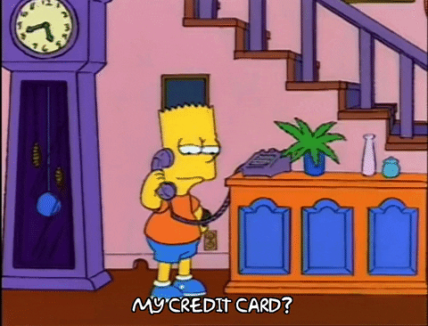
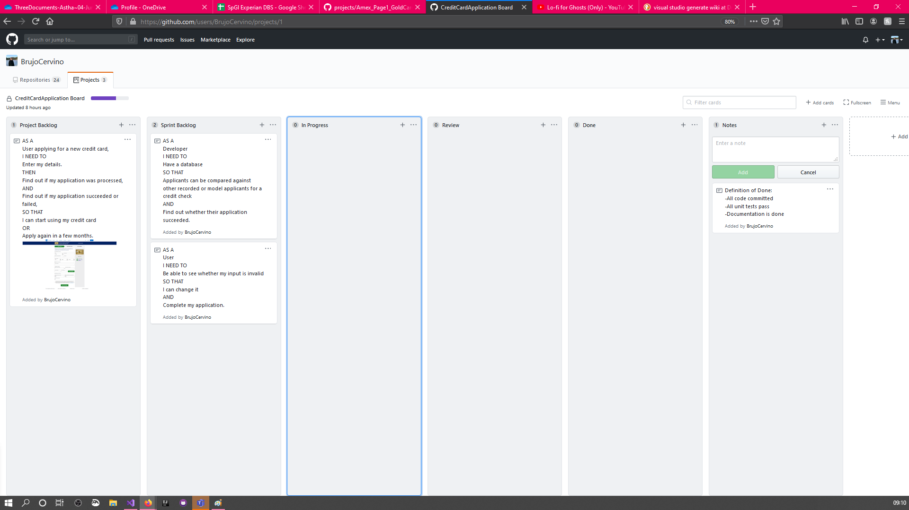
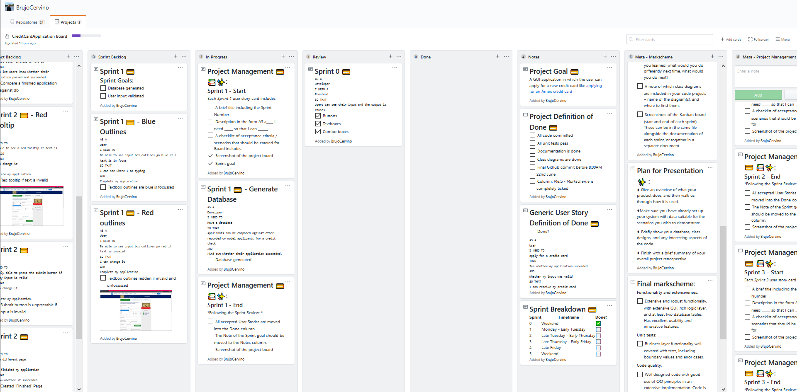

# Project 2 - CreditCardApplications

### An application which allows users to apply for a new credit card


<br/><br/>

## The Project

~ ***[Please refer to the Github Project board here](https://github.com/users/BrujoCervino/projects/1)*** ~
<br/>
**Timeframe**: Sat: Jun-13-2020 - Mon: Jun-22-2020
<br/><br/>


💳 **[Project Goal](https://github.com/users/BrujoCervino/projects/1#card-40161516)**:
A GUI application in which the user can apply for a new credit card like [applying for an Amex credit card](https://www.americanexpress.com/uk/credit-cards/gold-credit-card/?linknav=uk-amex-cardshop-allcards-learn-GoldCreditCard).

💳 **[Project Definition of Done](https://github.com/users/BrujoCervino/projects/1#card-40161516)**:
<br/>(See link above)

💳 **[Generic User Story Definition of Done](https://github.com/users/BrujoCervino/projects/1#card-40170129)**
```
AS A 
User
I NEED TO
apply for a credit card
THEN
See whether my application suceeded 
AND 
Whether my input was valid
SO THAT
I can receive my credit card
```

💳 **[Sprint Breakdown](https://github.com/users/BrujoCervino/projects/1#card-40165324)**

|Sprint|Timeframe|Done?|Screenshot start|Screenshot end
|------|-----------------------------|---|--|--|
|0 (Meta-sprint)    |Weekend         |✅|*[Unnecessary]*||
|1     |Monday - Early Tuesday       |⬜️|||
|2     |Late Tuesday - Early Thursday|⬜️|||
|3     |Late Thursday - Early Friday |⬜️|||
|4     |Late Friday                  |⬜️|||
|5     |Weekend                      |⬜️|||


💳 **Project Retrospective**

*[Fill this out upon completion of the project]*
- [ ] What have you learned?
- [ ] What would you do differently next time 
- [ ] What would you do next?

## Code

### Projects

| .csproj | Purpose |
|---------|---------|
|Globals|Global variables|
|FrontEnd|GUI|
|DatabaseBackEnd|Database|
|CrudManager|"Business end": Communication between the database and the front-end|
|FrontEndTests|GUI Test|

### Class Diagrams

Find class diagrams within [the class diagrams folder](https://www.broken.com).

