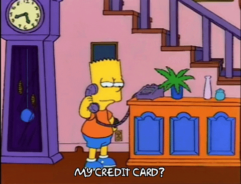
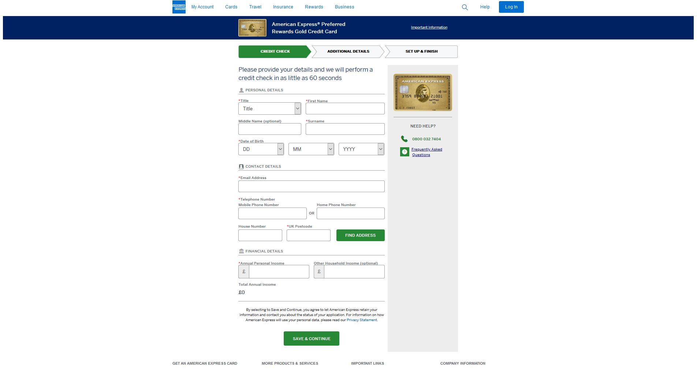
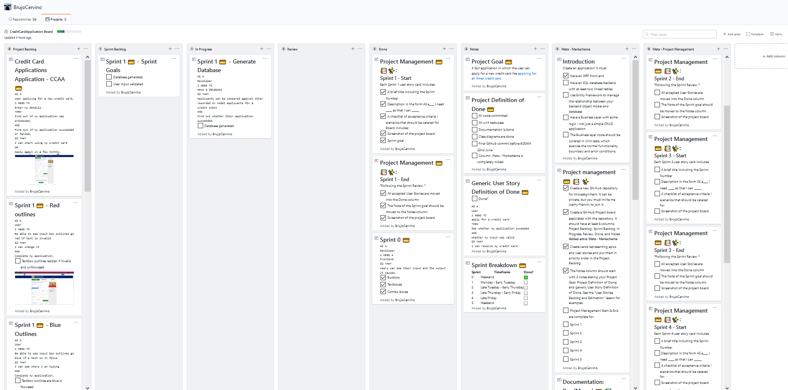
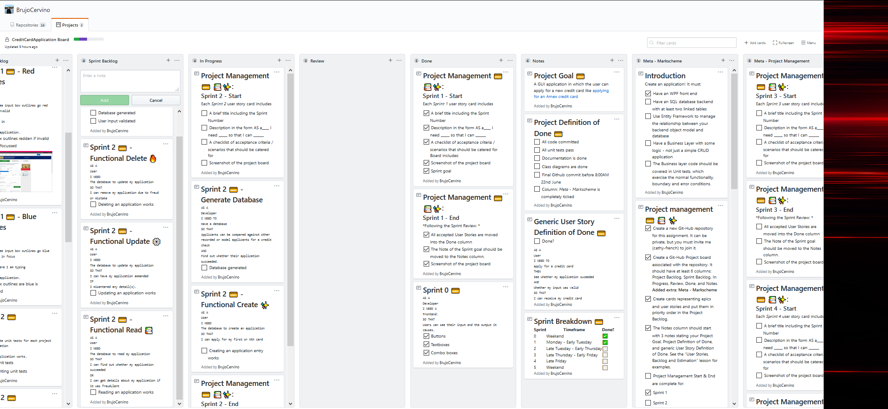
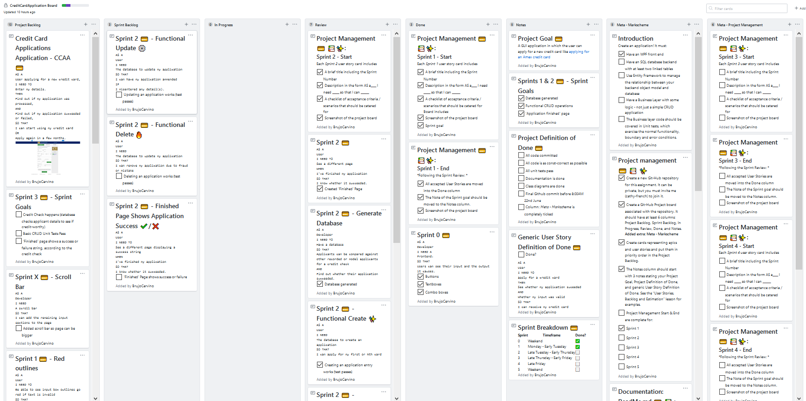
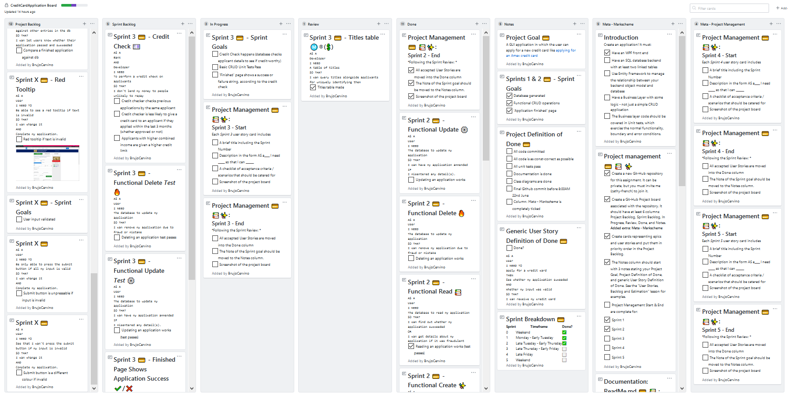
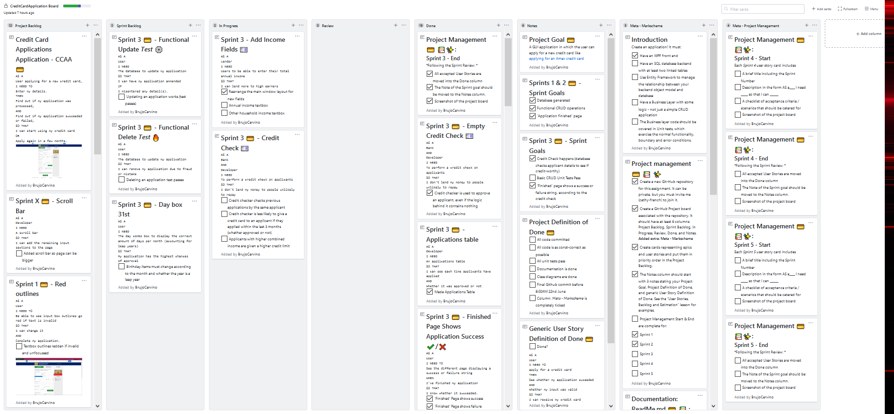
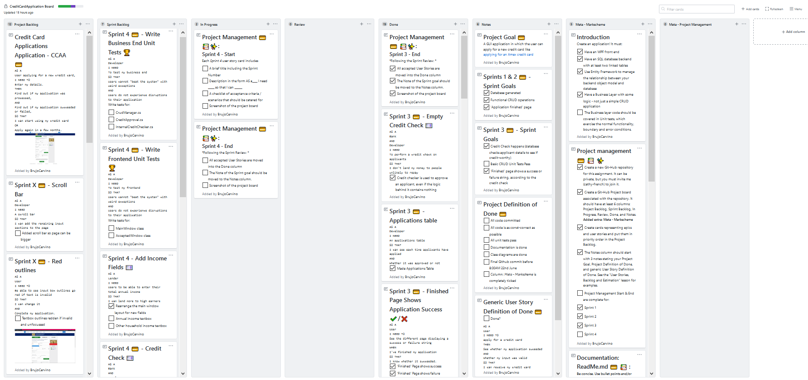
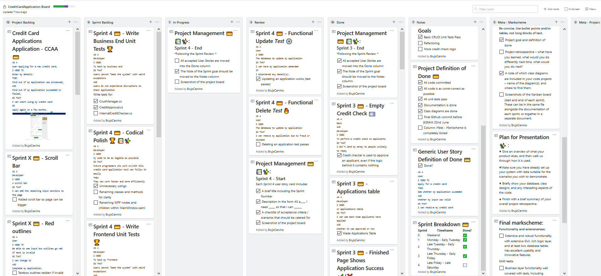

# Project 2 - CreditCardApplications

### An application which allows users to apply for a new credit card


<br/><br/>

## The Project

~ ***[Please refer to the Github Project board here](https://github.com/users/BrujoCervino/projects/1)*** ~
<br/>
**Timeframe**: Sat: Jun-13-2020 - Mon: Jun-22-2020
<br/><br/>


💳 **[Project Goal](https://github.com/users/BrujoCervino/projects/1#card-40161516)**:
A GUI application in which the user can apply for a new credit card like [applying for an Amex credit card](https://www.americanexpress.com/en-gb/credit-cards/apply/personal/gold-credit?intlink=uk-amex-cardshop-details-apply-GoldCreditCard-top).



💳 **[Project Definition of Done](https://github.com/users/BrujoCervino/projects/1#card-40161516)**:
<br/>(See link above)

💳 **[Generic User Story Definition of Done](https://github.com/users/BrujoCervino/projects/1#card-40170129)**
```
AS A 
User
I NEED TO
apply for a credit card
THEN
See whether my application suceeded 
AND 
Whether my input was valid
SO THAT
I can receive my credit card
```

💳 **[Sprint Breakdown](https://github.com/users/BrujoCervino/projects/1#card-40165324)**

|Sprint|Timeframe|Done?|Screenshot Start [Files](https://github.com/BrujoCervino/CreditCardApplications/tree/master/SprintScreenshots)|Screenshot End [Files](https://github.com/BrujoCervino/CreditCardApplications/tree/master/SprintScreenshots)
|------|-----------------------------|---|--|--|
|0 (Meta-sprint)    |Weekend         |✅|*[Unnecessary]*||
|1     |Monday - Early Tuesday       |✅|||
|2     |Late Tuesday - Early Thursday|✅|||
|3     |Late Thursday - Early Friday |✅|||
|4     |Late Friday                  |⬜️|||
|5     |Weekend                      |⬜️|||

💳 **Sprint Reviews**

♦ **0: Mon, Jun-13**: Showed stakeholder my GUI.<br/>
♦ **1: Tue, Jun-14**: Showed stakeholder my project management ([ReadMe.md](https://github.com/BrujoCervino/CreditCardApplications/blob/master/README.md) and [Project Board](https://github.com/users/BrujoCervino/projects/1)). 
<br/>♣   Renamed [Sprint 1 💳 - Sprint Goals](https://github.com/users/BrujoCervino/projects/1#card-40190169) to *Sprint 2 💳 - Sprint Goals* <br/>

|Name|Moved From Column|Moved To Column|
|----|-----------------|---------------|
|[Sprint 0](https://github.com/users/BrujoCervino/projects/1#card-40162414)|[Review](https://github.com/users/BrujoCervino/projects/1#column-9611786)|[Done](https://github.com/users/BrujoCervino/projects/1#column-9611771)|
|[Project Management 💳 📚✨: Sprint 1 - End](https://github.com/users/BrujoCervino/projects/1#card-40171151)|[Review](https://github.com/users/BrujoCervino/projects/1#column-9611786)|[Done](https://github.com/users/BrujoCervino/projects/1#column-9611771)|
|[Project Management 💳 📚✨: Sprint 1 - Start](https://github.com/users/BrujoCervino/projects/1#card-40171151)|[Review](https://github.com/users/BrujoCervino/projects/1#column-9611786)|[Done](https://github.com/users/BrujoCervino/projects/1#column-9611771)|

♦ **2: Thu, Jun-18**: Showed **stakeholder group** the new 'Accepted' Window and my project management
<br/>

|Name|Moved From Column|Moved To Column|
|----|-----------------|---------------|
|[Project Management 💳 📚✨:Sprint 2 - Start](https://github.com/users/BrujoCervino/projects/1#card-40171942)|[Review](https://github.com/users/BrujoCervino/projects/1#column-9611786)|[Done](https://github.com/users/BrujoCervino/projects/1#column-9611771)|
|[Sprint 2 💳 - 'Application Finished' Page 📃](https://github.com/users/BrujoCervino/projects/1#card-40288826)|[Review](https://github.com/users/BrujoCervino/projects/1#column-9611786)|[Done](https://github.com/users/BrujoCervino/projects/1#column-9611771)|
|[Sprint 2 💳 - Generate Database](https://github.com/users/BrujoCervino/projects/1#card-40171523)|[Review](https://github.com/users/BrujoCervino/projects/1#column-9611786)|[Done](https://github.com/users/BrujoCervino/projects/1#column-9611771)|
|[Sprint 2 💳 - Functional Create ✨](https://github.com/users/BrujoCervino/projects/1#card-40204405)|[Review](https://github.com/users/BrujoCervino/projects/1#column-9611786)|[Done](https://github.com/users/BrujoCervino/projects/1#column-9611771)|
|[Sprint 2 💳 - Functional Read 📚](https://github.com/users/BrujoCervino/projects/1#card-40206819)|[Review](https://github.com/users/BrujoCervino/projects/1#column-9611786)|[Done](https://github.com/users/BrujoCervino/projects/1#column-9611771)|
|[Sprint 2 💳 - Functional Delete 🔥](https://github.com/users/BrujoCervino/projects/1#card-40207360)|[Review](https://github.com/users/BrujoCervino/projects/1#column-9611786)|[Done](https://github.com/users/BrujoCervino/projects/1#column-9611771)|
|[Sprint 2 💳 - Functional Update ⚙️](https://github.com/users/BrujoCervino/projects/1#card-40316123)|[Review](https://github.com/users/BrujoCervino/projects/1#column-9611786)|[Done](https://github.com/users/BrujoCervino/projects/1#column-9611771)|
|[Project Management 💳 📚✨: Sprint 2 - End](https://github.com/users/BrujoCervino/projects/1#card-40171967)|[Review](https://github.com/users/BrujoCervino/projects/1#column-9611786)|[Done](https://github.com/users/BrujoCervino/projects/1#column-9611771)|
|[Sprints 1 & 2 💳  - Sprint Goals](https://github.com/users/BrujoCervino/projects/1#card-40190169)|[Review](https://github.com/users/BrujoCervino/projects/1#column-9611786)|[Notes](https://github.com/users/BrujoCervino/projects/1#column-9611790)|


<br/>

♦ **3: Fri, Jun 19**: Showed stakeholder my GUI, project management and code
<br/>

|Name|Moved From Column|Moved To Column|
|----|-----------------|---------------|
|[Project Management 💳 📚✨: Sprint 3 - Start](https://github.com/users/BrujoCervino/projects/1#card-40172042)|[Review](https://github.com/users/BrujoCervino/projects/1#column-9611786)|[Done](https://github.com/users/BrujoCervino/projects/1#column-9611771)|
|[Sprint 3 💳 - User cannot submit until they have chosen the needed details 2 📅](https://github.com/users/BrujoCervino/projects/1#card-40356831)|[Review](https://github.com/users/BrujoCervino/projects/1#column-9611786)|[Done](https://github.com/users/BrujoCervino/projects/1#column-9611771)|
|[Sprint 3 💳 - User cannot submit until they have chosen the needed details 1 📅](https://github.com/users/BrujoCervino/projects/1#card-40346811)|[Review](https://github.com/users/BrujoCervino/projects/1#column-9611786)|[Done](https://github.com/users/BrujoCervino/projects/1#column-9611771)|
|[Sprint 3 💳 - Titles table Ⓜ️®️(💲)](https://github.com/users/BrujoCervino/projects/1#card-40316929)|[Review](https://github.com/users/BrujoCervino/projects/1#column-9611786)|[Done](https://github.com/users/BrujoCervino/projects/1#column-9611771)|
|[Sprint 3 💳 - Finished Page Shows Application Success ✔️/❌](https://github.com/users/BrujoCervino/projects/1#card-40167618)|[Review](https://github.com/users/BrujoCervino/projects/1#column-9611786)|[Done](https://github.com/users/BrujoCervino/projects/1#column-9611771)|
|[Sprint 3 💳 -  Applications table](https://github.com/users/BrujoCervino/projects/1#card-40316936)|[Review](https://github.com/users/BrujoCervino/projects/1#column-9611786)|[Done](https://github.com/users/BrujoCervino/projects/1#column-9611771)|
|[Sprint 3 💳 - Empty Credit Check 💷](https://github.com/users/BrujoCervino/projects/1#card-40361850)|[Review](https://github.com/users/BrujoCervino/projects/1#column-9611786)|[Done](https://github.com/users/BrujoCervino/projects/1#column-9611771)|
|[ Project Management 💳 📚✨: Sprint 3 - End](https://github.com/users/BrujoCervino/projects/1#card-40172015)|[Review](https://github.com/users/BrujoCervino/projects/1#column-9611786)|[Done](https://github.com/users/BrujoCervino/projects/1#column-9611771)|
|[Sprint 3 💳 - Sprint Goals](https://github.com/users/BrujoCervino/projects/1#card-40287094)|[Review](https://github.com/users/BrujoCervino/projects/1#column-9611786)|[Notes](https://github.com/users/BrujoCervino/projects/1#column-9611790)|


💳 **Sprint Retrospective**
<br/><br/>
♦ **0: Mon, Jun-15**: Happy I got so far in replicating the source material: I've almost nailed the visuals.<br/>
♣ *Learned*: Lots and lots of WPF: ComboBoxes, ListBoxes, rounded corners and more. <br/>
♣ *What I'll do differently next time*: Get the database up and running as well as just the GUI.<br/>
<br/>
♦ **1: Tue, Jun-16**: Happy I got so far with project management. That will save me time and stress later in the project.<br/>
♣ *Learned*: Lots of Github Markdown language (for this documentation and the project board). How to make foreign keys in SQL Server.<br/>
♣ *What I'll do differently next time*: Get the database up and running: I am almost there and it should be done by tomorrow's sprint's end.<br/>
<br/>
♦ **2: Thu, Jun-18**: Happy I got CRUD operations working and the 'accepted' window. Unhappy with lots of "invisible work": my frontend barely looks different than it did at the start - is this because I got most of it out the way early?<br/>
♣ *Learned*: How to make a new window, that tests for CRUD take longer to write than standard tests.<br/>
♣ *What I'll do differently next time*: Write more unit tests, write them earlier.<br/>
<br/>
♦ **3: Fri, Jun-19**: Happy I got user input validated, a working 'check failed' version of the 'accepted' window and have consistently kept my board well-organised<br/>
♣ *Learned*: I should commit more regularly- intra-sprint-card commits are not a bad thing: better too many than none and an irretrievably broken project.<br/>
♣ *What I'll do differently next time*: I was too ambitious in Sprint 3. I need to set more realistic goals next time - each project is another learning experience.<br/>
<br/>

💳 **Project Retrospective**

*[Fill this out upon completion of the project]*
- [ ] What have you learned?
- [ ] What would you do differently next time 
- [ ] What would you do next?

## Code

### Projects

| .csproj | Purpose |
|---------|---------|
|Globals|Global variables|
|FrontEnd|GUI|
|DatabaseBackEnd|Database|
|CrudOperations|"Business end": Communication between the database and the front-end|
|FrontEndTests|GUI Tests|
|CrudOperationsTests| "Business end" Tests|

### Class Diagrams

Find class diagrams within [the class diagrams folder](https://github.com/BrujoCervino/CreditCardApplications/tree/master/ClassDiagrams).

